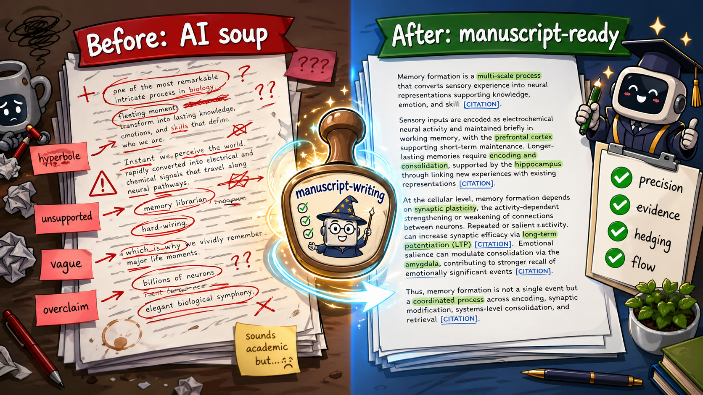
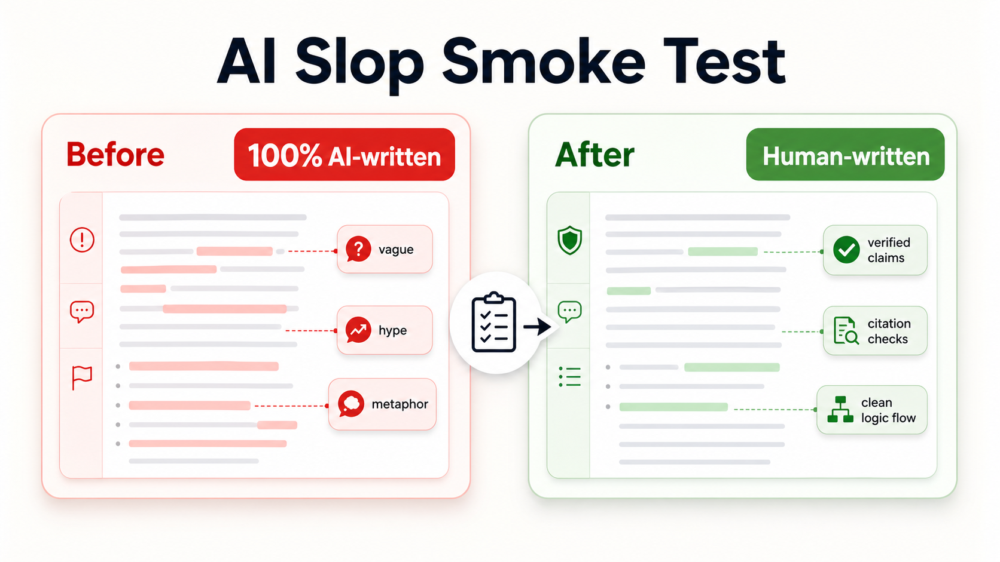
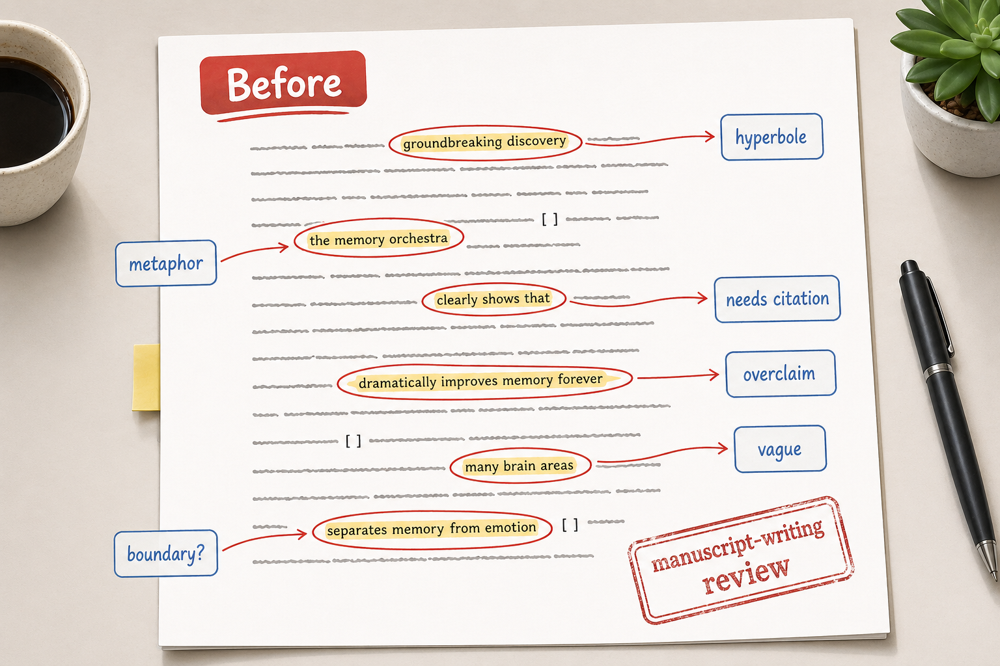

# manuscript-writing




`manuscript-writing` is an installable `SKILL.md` skill for revising and reviewing scientific, technical, and academic writing.

A few years ago, dissertation polishing meant a committee comment, a reference manager, and a 2 a.m. argument with Track Changes. This repo plays the toughest committee member for your AI assistant: every claim gets questioned, every vague flourish gets circled, and only evidence-bounded prose gets to walk across the stage.

## What It Does

This skill has two modes:

- `revision`: edits the manuscript or supplied text directly. For `.doc`, `.docx`, or `.pdf` inputs, it creates a new revised document and leaves the original unchanged; comments are reserved for unresolved verification needs, rationale, or author questions.
- `review`: comments on issues without editing the source. For pasted text, it lists actionable suggestions. For `.doc`, `.docx`, or `.pdf` inputs, it creates a new commented document with suggested revisions in the comments.

Both modes read `references/revision-checklist.md` before acting and follow the checklist sequentially. In this workspace, the skill also follows `/home/ezdies/AntiSlopPL/POLISH_ACADEMIC_CORE.md` for Polish academic prose. It uses verified facts only and flags unavailable evidence under `Do weryfikacji`.

## AI Slop Smoke Test



In the user-run GPTZero check for the example below, the original paragraph was reported as `100% AI-written`, while the revised paragraph was reported as human-written. That before/after result is a useful smoke test for what the checklist targets: unsupported praise, metaphor-heavy explanations, overconfident causality, missing citation boundaries, and disconnected fact-stacking.

This is not a promise that every output will pass any detector, and it is not a claim that detector scores prove authorship. GPTZero's own support documentation describes AI-detection results as probabilistic and advises against using a detector result as the only proof for academic punishment or discipline. Use this section as a practical "less AI slop" demonstration, not as an authorship guarantee. See GPTZero's note on [interpreting AI-detection results](https://support.gptzero.me/articles/7549392421-how-do-i-interpret-results-from-gptzero-s-advanced-sentence-scanning).

## Example

The image below demonstrates `review` mode: the source text remains unchanged while the skill marks weak spots and explains why they need attention.



The paragraph below is a user-provided example of AI-written prose. The revised version demonstrates `revision` mode under the current checklist: preserve technical meaning, remove hyperbole, hedge unsupported causality, permit logical transitions, and flag claims that require citations. Citation placeholders mark unresolved verification needs; they do not add evidence.

### Before

> Memory formation in the human brain is one of the most remarkable and intricate processes in biology, transforming fleeting moments of experience into lasting knowledge, emotions, and skills that define who we are. It begins the instant we perceive the world through our senses--sights, sounds, smells, and touches are rapidly converted into electrical and chemical signals that travel along neural pathways. These signals first enter short-term or working memory, a temporary "holding area" supported by the prefrontal cortex. For information to endure, it must undergo encoding and consolidation, a process heavily orchestrated by the hippocampus, which acts as a kind of "memory librarian," indexing new experiences and linking them to existing knowledge.
>
> At the cellular level, memory formation relies on synaptic plasticity--the brain's ability to strengthen or weaken connections between neurons. When we repeat an experience or pay close attention to it, synapses fire more efficiently through a mechanism called long-term potentiation (LTP), essentially "hard-wiring" the memory into neural circuits. Emotional events receive extra reinforcement from the amygdala, which is why we vividly remember where we were during major life moments. Over hours and days (especially during deep sleep), these fragile traces are stabilized and distributed across the cortex for long-term storage.
>
> In short, every memory we form is the result of billions of neurons communicating, adapting, and reorganizing themselves--an elegant biological symphony that turns the chaos of daily life into the coherent story of our lives.

### Review Mode Comments

- **Strip hyperbole**
  - Flagged text: "remarkable", "intricate", "elegant biological symphony"
  - Suggested action: Replace subjective praise with specific mechanisms.

- **Explain or remove metaphors**
  - Flagged text: "memory librarian", "hard-wiring"
  - Suggested action: Use mechanistic terms or define the analogy briefly.

- **Calibrate certainty**
  - Flagged text: "which is why we vividly remember"
  - Suggested action: Hedge unless cited evidence supports the causal claim.

- **Verify numerical claims**
  - Flagged text: "billions of neurons"
  - Suggested action: Cite the magnitude or remove it.

- **Use transitions logically**
  - Flagged text: "In short"
  - Suggested action: Keep the transition only if the sentence accurately summarizes the preceding evidence; revise the overgeneralized claim.

- **Verify citation coverage**
  - Flagged text: claims about working memory, hippocampus, LTP, amygdala, sleep, and cortical distribution
  - Suggested action: Add citations or mark these claims as needing verification.

- **Audit multi-level flow and logic**
  - Flagged text: the paragraph sequence moves from sensory encoding to working memory, hippocampal consolidation, synaptic plasticity, emotional modulation, and cortical distribution.
  - Suggested action: Add sentence-to-sentence links so these claims read as one process rather than separate facts.

### Revision Mode Output

> Memory formation transforms sensory experience into knowledge, emotional associations, and skills. The process begins when sensory inputs are converted into electrical and chemical neural signals. Some of this information can be maintained briefly in short-term or working memory, a process associated with the prefrontal cortex [citation needed]. For information to persist beyond this temporary state, it must undergo encoding and consolidation. The hippocampus supports this transition by indexing new experiences and linking them to existing knowledge [citation needed].
>
> These systems-level changes depend on cellular mechanisms. Synaptic plasticity allows synaptic connections to strengthen or weaken over time. When an experience is repeated or receives attention, synaptic efficacy can increase through mechanisms such as long-term potentiation (LTP) [citation needed]. Emotional events can receive additional reinforcement from the amygdala, which may help explain stronger recall of major life events [citation needed]. Over hours to days, especially during deep sleep, initially fragile memory traces can stabilize and become distributed across the cortex [citation needed].
>
> In short, memory formation links sensory encoding, temporary maintenance, consolidation, synaptic adaptation, emotional modulation, and cortical distribution. These connected processes convert sensory experience into information that can be maintained, consolidated, and later recalled.

### Revision Log

- Removed subjective intensifiers and metaphor-heavy phrasing.
- Replaced broad identity-focused language with evidence-bounded descriptions drawn from the source paragraph.
- Hedged causal statements about emotional salience and recall.
- Kept a logical summary transition where it accurately connects the conclusion to the preceding paragraph.
- Added sentence-to-sentence links so the revision reads as a connected process rather than isolated facts.
- Added citation placeholders instead of inventing support.

### Do weryfikacji

- Add citations for the roles of working memory, the prefrontal cortex, hippocampal consolidation, synaptic plasticity, LTP, amygdala modulation, and sleep-dependent consolidation.
- Confirm whether the paragraph should remain general or be narrowed to a specific memory type, organism, method, or evidence base.
- Verify whether the intended audience needs simplified definitions for LTP, consolidation, and cortical distribution.

## Compatibility

| Agent | Install target | Invocation style |
| --- | --- | --- |
| Codex | `${CODEX_HOME:-$HOME/.codex}/skills/manuscript-writing` | `Use $manuscript-writing ...` |
| Claude Code | `~/.claude/skills/manuscript-writing` or `.claude/skills/manuscript-writing` | `/manuscript-writing ...` |
| OpenClaw | `~/.openclaw/skills/manuscript-writing` or `skills/manuscript-writing` | Use when the request matches the skill description |
| Generic AI agent with web or repo access | Send the repo link: `https://github.com/YSLAB-ai/manuscript-writing` | Ask it to read `SKILL.md` and follow `references/revision-checklist.md` |
| Web-based AI chat, such as ChatGPT or Gemini | Send the repo link if the chat can open URLs; otherwise paste `SKILL.md` and `references/revision-checklist.md` | Ask for `revision` mode to edit text or `review` mode to list suggestions only |

## Install

### Codex

```bash
git clone https://github.com/YSLAB-ai/manuscript-writing.git "${CODEX_HOME:-$HOME/.codex}/skills/manuscript-writing"
```

Restart Codex after installing.

### Claude Code

Personal skill:

```bash
git clone https://github.com/YSLAB-ai/manuscript-writing.git ~/.claude/skills/manuscript-writing
```

Project skill:

```bash
git clone https://github.com/YSLAB-ai/manuscript-writing.git .claude/skills/manuscript-writing
```

Claude Code can invoke skills directly with `/skill-name`, and personal skills live under `~/.claude/skills/<skill-name>/SKILL.md`. See the [Claude Code skills documentation](https://code.claude.com/docs/en/skills).

### OpenClaw

Global skill:

```bash
git clone https://github.com/YSLAB-ai/manuscript-writing.git ~/.openclaw/skills/manuscript-writing
openclaw skills check
```

Workspace skill:

```bash
git clone https://github.com/YSLAB-ai/manuscript-writing.git skills/manuscript-writing
openclaw skills check
```

OpenClaw loads skills from directories containing `SKILL.md`, including `~/.openclaw/skills/<skill-name>/SKILL.md` and `<workspace>/skills/<skill-name>/SKILL.md`. See the [OpenClaw skills documentation](https://openclawcn.com/en/docs/agent/skills/).

## Use

### Revision Mode

Use this when you want the document edited.

```text
Use $manuscript-writing in revision mode on this manuscript section.
Edit the text directly, preserve technical meaning, and return a revision log plus any `Do weryfikacji` items.
```

For document files:

```text
Use $manuscript-writing in revision mode on this DOCX/PDF.
Create a new revised document. Apply supported edits in the text, keep my original unchanged, and use comments only for unresolved verification notes or author questions.
```

For Claude Code:

```text
/manuscript-writing revision mode: edit this paragraph for academic precision and concision.
```

### Review Mode

Use this when you want comments only.

```text
Use $manuscript-writing in review mode on this draft.
Do not edit the document. List issues, why they matter, and specific suggested actions.
```

For document files:

```text
Use $manuscript-writing in review mode on this DOCX/PDF.
Create a new commented document. Do not edit the manuscript body; put suggested revisions, citation needs, and verification steps in comments.
```

For Claude Code:

```text
/manuscript-writing review mode: critique this introduction without editing it.
```

## Repository Layout

```text
LICENSE
CONTRIBUTING.md
CONTRIBUTORS.md
SKILL.md
README.md
.gitignore
.github/ISSUE_TEMPLATE/skill-feedback.md
.github/pull_request_template.md
assets/hero.png
assets/demo-review.png
assets/detector-check.png
agents/openai.yaml
references/revision-checklist.md
```

## Contributing

Checklist improvements, clearer examples, and install fixes are welcome. Please see [CONTRIBUTING.md](CONTRIBUTING.md) before opening a pull request.

## Contributors

See [CONTRIBUTORS.md](CONTRIBUTORS.md). Current contributors are derived from git history.

## License

MIT. See [LICENSE](LICENSE).
